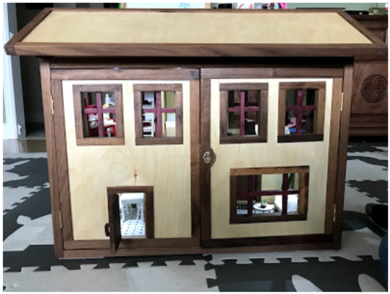
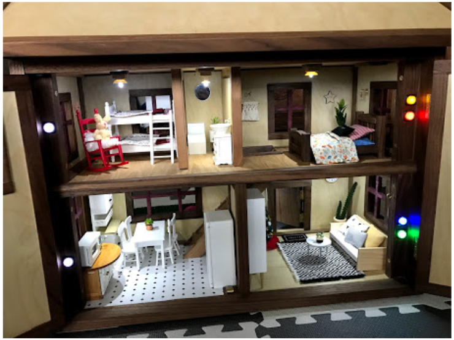
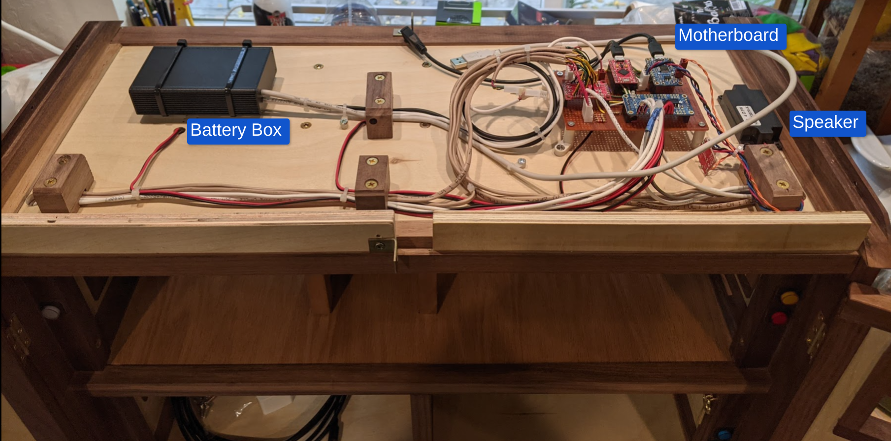

# Ada's Dollhouse Controller

  Written and (C) 2020 Andy Swing
  
  Provided under the terms of the MIT license.

## Overview
Ada's Dollhouse Controller adds advanced lighting and sound effects to a custom
built wooden dollhouse fitted with a number of pushbuttons, LED light fixtures,
and a speaker. It is built around a Arduino microcontroller and various I/O
modules placed on a custom, hand-wired motherboard. Everything is powered by an
internal rechargeable battery pack and includes auto-off features to ensure
many hours of play time between recharges. Power and programming ports are
accessible externally to allow for easy modification down the road.

## Theory of Operation

### Turning On

* Press the red main power button on the end of the roof
* A chime will play and the system will turn on
* The button lights up to tell you status:
  * Slow fade in and out: system is on
  * Fast blinking: low battery
  * Off: power is off, obviously :)

### Turning Off

#### Manually
* Press the red power button and everything will shut off

#### Automatically
* The lights will turn off after 1 hour of no activity
* The system will power down after 1h 10m of no activity
* Any interaction (aka button press) will restart these shutdown timers
* Note that once the system power is off, the red power button is the only way to turn the system back on is via the main power button

### Charging and Battery Life

* The battery should last 12+ hours with all lights on (many hours of play!)
* The system will play a chime & announcement and blink the power button when the battery gets low
* You don't have to wait for the low battery indicator to charge - it's good practice to plug it in every few weeks to top it off (better for battery life)
* Charge port is a large type-B USB connector on the roof end (small one is for programming)
* A full charge takes ~12 hours to complete, so leave plugged in for a while
* Totally fine to charge and use at the same time (designed specially to do this!)

### Lights

* Each room has a light fixture and pushbutton light switch
* Press the button to toggle the light state and the light will fade on/off accordingly

### Sound Effects

* The doorbell rotates through a set of 5 different greetings (more can be added easily!)
* Each room has a sound too, triggered either when the lights are turned on or off depending on the room
* If a sound is already playing, a new one will not interrupt it (idea was to avoid super annoying button mashing...)

## Construction

Schematics are located in the 'schematics' sub-folder. Two of the modules needed some small tweaks.

**TODO:** *Describe more about how the circuits work and were built. Also include a BOM.*

## History

* 1.0 - 2021/01/03 - TheOriginalAndrobot
  - fully implemented functionality
  - moved to a more advanced power control scheme that powers down completely after a timeout

* 0.9 - 2020/12/31 - TheOriginalAndrobot
  - first mostly working version
